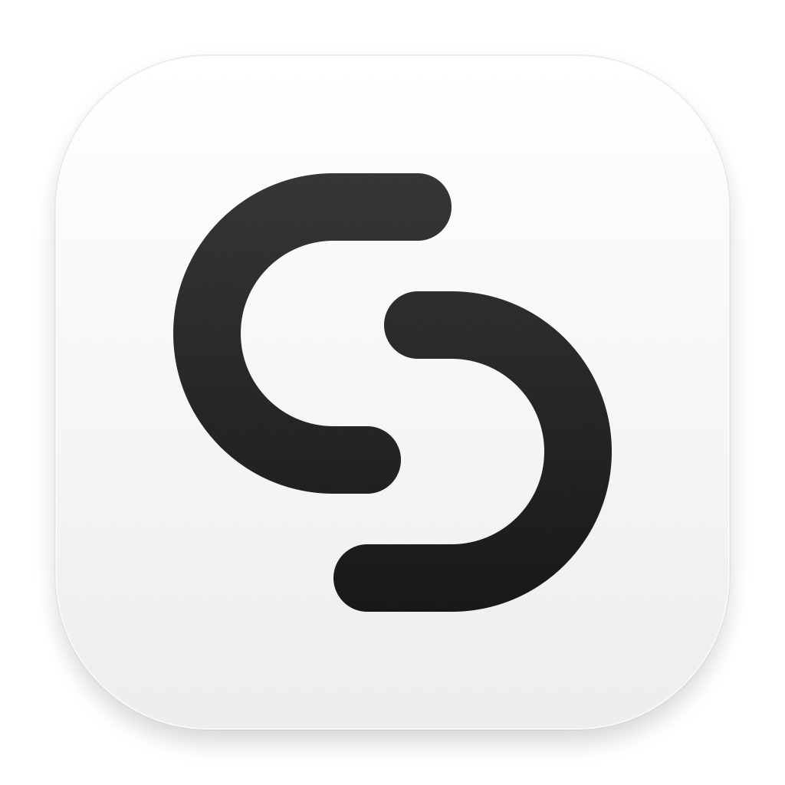

# Relay



**一个面向本地 AI Agents 的桌面统一入口，让 Codex、Claude Code、OpenCode 等 Agent 可以在电脑上的任何场景被即时调用。**

Relay 以项目组织长期上下文，以主 Agent 协调工作，通过 Agent Client Protocol（ACP）连接具体 Agent，使用 Rust 实现。

## 已确定的产品原则

- **随处调用**：网页划词弹窗、全局快捷键、客户端对话、语音唤醒及视觉与语音交互。
- **项目持有上下文**：资料、历史、记忆、决策和成果归属于项目，与具体 Agent 分离。
- **主 Agent 调度**：用户与项目主 Agent 沟通；主 Agent 决定任务拆分、执行 Agent、上下文范围与结果整合。
- **ACP 统一连接**：Relay 作为 ACP Client，连接原生支持 ACP 的 Agent 或兼容适配器。
- **Rust 实现**：UI、桌面核心、项目上下文服务、任务运行管理和 ACP 客户端均使用 Rust。
- **UI 框架**：采用 GPUI + GPUI Kit 的 Rust 组件层。
- **macOS 优先**：先完成 macOS 的桌面体验，再评估后续平台适配。

## 当前状态

已实现 macOS 原生工作台及首个真实 Agent 接入：Codex。使用 Rust、GPUI + GPUI Kit。

- 左侧导航与项目切换，中间工作区；按当前设计暂不显示右侧任务栏。
- 多行输入、项目独立草稿、快捷动作、`⌘K` 项目搜索。
- 首页输入通过 Jev 判断复用已有项目或新建项目，再交给 Codex；判断不明确或接口不可用时手动选择。项目内追问保持当前归属。
- **设置 → 语言** 支持简体中文 / English，首次默认中文，切换立即生效并在重启后保留；不影响草稿和 Agent 对话。
- 内置 Codex 入口，首次使用按需安装固定版本；也可选择已有 Codex 可执行文件。
- 输入框中的 **Harness + Model** 菜单，模型与其他选项来自 ACP 实际返回。
- 真实流式对话、工具状态、权限确认、取消、原生会话恢复。
- 按项目保存可见对话和工作目录，重启后恢复；Agent 会话与项目记录独立。
- 真实项目列表：新建、编辑名称/说明/指令；文字资料可添加、编辑、选用与移除，全部独立于 Agent 保存。
- 首轮追加项目上下文快照，后续只追加变化；原生恢复沿用已确认的同步进度，异常后保守重建快照。
- 回复详情显示首字延迟、整轮耗时、上下文交付与可选缓存用量；Codex 用量按最近一次模型请求展示。
- 开发模式默认开启：右键 **检查元素**，或 `⌘⌥I` 打开 GPUI Inspector，再点击目标元素查看布局和样式。
- 原创 Relay 标志及 macOS 应用图标。

输入草稿只保留在当前进程中。文字资料可直接粘贴保存；文件/网页/图片导入、主 Agent 委派、系统划词、语音和视觉尚未实现。首次升级保留旧项目及已有对话，不迁入示例资料。

点击左侧 **项目 +** 创建项目，标题右上方齿轮编辑项目指令；输入框 **添加上下文** 管理文字资料。只有选用的资料会随下一条消息发送，修改不会影响正在执行的轮次。每份资料最多 12,000 字，选用上下文合计最多 32,000 字，超限时明确提示。

**设置 → Jev** 支持 Vercel AI Gateway 和 TypeSafe 两个渠道。保存对应 API key 后，可在首页直接输入需求，由 Jev 分配项目；使用 Vercel 无需另有 TypeSafe 密钥。密钥保存在 macOS 钥匙串中；请求包含本次输入、项目名称/说明片段和少量近期用户提问。缺少密钥或免费额度不可用时仍能手动选择项目。试用条件与接口详见 [Jev 项目归属方案](docs/PROJECT-ROUTING.md)。

打开项目输入框的 **Codex** 菜单，选择 **安装并连接 Codex / 连接 Codex**（英文界面为 **Set up Codex / Connect Codex**）。已有 Codex 登录通常可直接复用；否则按返回的登录方式完成认证。连接后选择模型并发送消息。**智能体 / Agents** 页面管理安装来源与项目工作目录。详见 [Codex 接入](docs/CODEX.md)。

界面语言独立保存在 `~/Library/Application Support/Relay/settings.json`，也遵循 `RELAY_DATA_DIR`。导航、设置、快捷动作、连接状态与已知 ACP 选项随语言切换；用户对话、模型名称、路径与无法识别的上游诊断保留原文。

## 开发与运行

环境：macOS 15+、完整 Xcode（含 Metal 编译器）、Rust 1.97.1。Rust 版本由 `rust-toolchain.toml` 固定，依赖由 `Cargo.lock` 固定。

```sh
cargo run --locked
cargo xtask verify
cargo xtask bundle
open dist/Relay.app
```

`cargo xtask bundle --release` 生成发布优化的本地应用包。开发检查器由 `devtools` feature 控制；无开发工具的构建可使用 `cargo build -p relay --release --no-default-features --locked`。

## 项目文档

| 文档 | 内容 |
| --- | --- |
| [产品规格](docs/PRODUCT.md) | 产品定位、项目结构、桌面交互、主 Agent 调度与首版范围 |
| [技术架构](docs/ARCHITECTURE.md) | Rust 模块、ACP 边界、上下文所有权、任务执行与持久化 |
| [UI 框架选型](docs/UI-FRAMEWORK.md) | GPUI + GPUI Kit 的确定方案、比较依据与实现验证 |
| [包治理](docs/PACKAGES.md) | Cargo workspace 分层、依赖约束、自动检查和本地打包 |
| [Codex 接入](docs/CODEX.md) | 托管组件、登录、Harness + Model、持久化与验证 |
| [上下文与缓存落地方案](docs/CONTEXT-CACHING.md) | 项目版本、会话快照、增量同步、异常恢复与用量口径 |
| [Jev 项目归属方案](docs/PROJECT-ROUTING.md) | API、候选项目、判断门槛、自动新建/复用、异常回退与密钥管理 |

设计参考：[Claude Projects redesigned](https://claude.com/blog/projects-redesigned)。Relay 借鉴其项目主对话、执行线程、共享记忆与资料库的组织方式，并连接用户的本地 Agent。

需求基线：2026-09-22。当前依赖 GPUI Kit 0.6.6，底层 GPUI 由 Kit 配套管理。
