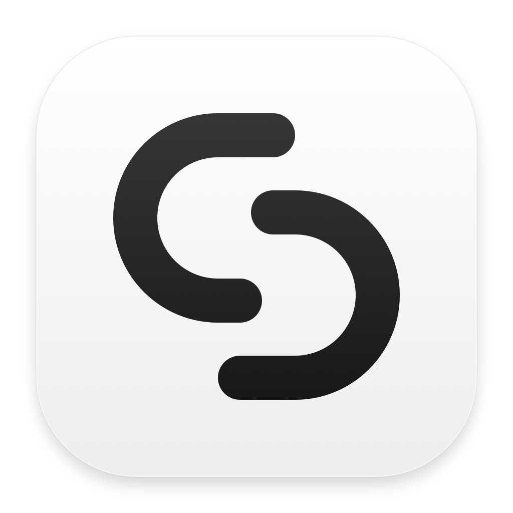

# Relay



**常驻的个人 Agent：持续对话，按需委派任务，记住有来源的偏好和决定。**

Relay 是 Rust / GPUI Kit 原生桌面应用，通过 ACP 连接本地 Codex。应用维护持续主对话、独立任务 thread、个人文件和原生记忆；不需要 Project 或 Jev 路由服务，也不接入 claude-mem 基建。

## 当前能力

- 首页、全局快捷入口、语音默认进入同一主对话；打开任务或显式选择任务后，输入进入该任务。话题变化不自动切换 thread。
- 主 Agent 使用 `create_task` / `continue_task` / `inspect_task` 调度；后台持久队列派发，结果回到主对话，活动页展示等待、进度、待检查和失败状态。
- 原生记忆参考 claude-mem 的工具事件采集、连续 observation、会话总结、恢复上下文和渐进检索，采用 Rust + SQLite/FTS5/向量索引 + 本地 stdio MCP；Embedding 支持 OpenAI 兼容服务。
- 记忆页面展示导入与提炼状态、候选和已确认记录、主题标签及来源；支持确认、修订、遗忘和失败重试。
- 历史 Codex session 在后台只读归档，从来源查看原始会话；旧“本地会话”Tab 和手动归属已移除。主题标签不改变会话身份或消息目标。
- 本地 Codex 发现、认证、真实流式对话、工具权限、模型配置、取消和原生 session 恢复。更多 Harness 待接入。
- thread 文字资料按需选用；个人 Files 空间支持导入、新建、文本/Markdown 编辑、图片及 PDF/Office 首页预览、冲突检测和本地文件跳转。
- `⌃⌥Space` 取得选区和 URL，Moli 后台补充网页上下文；小窗回复可展开到同一 thread。
- 本地“嘿 relay / Hey Relay”唤醒和 VAD，千问 ASR → 主对话 → TTS，支持连续轮次和取消；设置默认关闭语音。
- 中文/English、原生菜单、开发检查器、关闭窗口后常驻。退出应用结束工作进程。

后台记忆在主对话连接后开始提炼，默认最多 60 次模型调用/小时，可在对话中暂停或调整。用户可以让 Relay 检索来源、修订和遗忘记忆。候选 observation 不自动成为确认事实；来源改写会使旧结论失效。当前检索使用全文索引，归类使用模型主题标签，尚未接入向量检索或专门的聚类图界面。

首次升级会把旧项目保留为历史 thread，旧薄记忆作为来源重新提炼，主对话使用独立身份。旧文件保留。默认数据目录为 `~/Library/Application Support/Relay`，支持 `RELAY_DATA_DIR`。详细行为、迁移和限制见 [原生机制](docs/NATIVE-MEMORY.md)。

输入草稿只保留在当前窗口。普通对话可直接发送并连接本地 Codex；模型和执行权限由 Harness 提供。资料单条最多 12,000 字符，选用资料及指令合计最多 32,000 字符，下一条消息生效。自动划词浮现、截图问答、持续视觉、更多 Harness 和外部原生 session 续聊仍待开发。

## 开发与运行

选中文字后按 **Control + Option + Space** 打开小窗。首次读取选区需要在 macOS「隐私与安全性 → 辅助功能」允许 Relay；未授权或应用未暴露选区时可直接粘贴。小窗默认进入 Relay 主对话，可显式选择任务和 Codex 连接。Moli 1.1.10 首次有网页 URL 时后台按需安装，支持用 `RELAY_MOLI_PATH` 指定本地可执行文件。详见 [快捷入口方案](docs/QUICK-ENTRY.md)。

环境：macOS 15+、完整 Xcode（含 Metal 编译器）、Rust 1.97.1。Rust 版本由 `rust-toolchain.toml` 固定，依赖由 `Cargo.lock` 固定。

主对话使用本地 Codex 登录和模型配置，不需要 Jev/OpenRouter 密钥。可选语音服务配置见 `.env.example`；语音密钥可通过已签名应用的 `--voice-save-key` 从标准输入存入 macOS 钥匙串。

```sh
cargo xtask verify
cargo xtask bundle
cargo xtask start
```

`verify` 和 `bundle` 使用校验 SHA-256 的固定 sherpa-onnx 1.13.8 静态库；同时校验约 5.2 MiB 的唤醒模型、约 629 KiB 的 Silero VAD 模型及关键词，`bundle` 将这些资源和许可证复制到应用包。首次准备需要下载上游公开归档，之后复用校验后的 target 缓存，不需部署独立服务。直接 Cargo 调试前执行 `cargo xtask prepare-voice`，将打印的库目录设置为 `SHERPA_ONNX_LIB_DIR`；模型自动从 target 下的 `relay-resources/voice` 读取，`RELAY_WAKE_MODEL_DIR` 可显式覆盖，但仍要求清单与校验值一致。包边界和升级约束见 [包治理](docs/PACKAGES.md#语音唤醒领域)。

`start` 复用已运行的 Relay，更新构建后先退出旧进程再启动；启动日志写入 Cargo target 目录的 `relay-launch.log`。选区验收使用这条启动路径，让 macOS 将辅助功能权限归属于 Relay 自身。`cargo run --locked` 仍可用于代码调试，但直接从终端或其他应用启动二进制可能继承父进程的权限归属。

`bundle` 签名优先级为 `RELAY_SIGNING_IDENTITY` → 仓库根目录的 `.relay-signing-identity` → 已有 `dist/Relay.app` 的签名身份；均未配置时才使用 ad-hoc，重编译可能导致系统隐私授权失效，包括辅助功能、麦克风与文稿目录。`.relay-signing-identity` 保存证书名称或 SHA-1，已被 Git 忽略。已有开发者签名会自动沿用，签名失败不会退回 ad-hoc；也可显式设置 `RELAY_SIGNING_IDENTITY=-`。首次从 ad-hoc 切换到稳定证书仍可能需要重新授权。

原生机制的真实 Harness 检查可运行 `cargo run -p relay-runtime --example native_probe --locked -- --execute`。它使用临时 Relay 数据目录和当前本地 Codex 登录，验证记忆工具、异步任务回收与 observer 提炼，会使用模型额度。历史导入只读检查使用 `client_sessions_probe`，不调用模型。

`cargo xtask bundle --release` 生成发布优化的本地应用包。开发检查器由 `devtools` feature 控制；无开发工具的构建可使用 `cargo build -p relay --release --no-default-features --locked`。

## 项目文档

| 文档 | 内容 |
| --- | --- |
| [产品规格](docs/PRODUCT.md) | 持续主对话、任务、记忆、桌面入口和当前范围 |
| [技术架构](docs/ARCHITECTURE.md) | Rust 包边界、ACP、调度、恢复与上下文 |
| [常驻 Agent 与原生记忆](docs/NATIVE-MEMORY.md) | claude-mem 参考、SQLite、提炼队列、检索、主题和迁移 |
| [上下文与缓存](docs/CONTEXT-CACHING.md) | 资料快照、增量、异常恢复和用量口径 |
| [会话归档与记忆入口](docs/CLIENT-SESSIONS.md) | 后台归档、提炼状态、记忆审核与来源查看 |
| [快捷入口](docs/QUICK-ENTRY.md) | 选区、小窗、网页上下文与语音 |
| [个人文件](docs/PERSONAL-FILES.md) | 独立文件空间、编辑、预览和冲突检测 |
| [Codex 接入](docs/CODEX.md) | 本地安装、适配器、登录和模型 |
| [包治理](docs/PACKAGES.md) | 固定依赖、检查、资源和本地打包 |
| [UI 框架选型](docs/UI-FRAMEWORK.md) | GPUI + GPUI Kit |

需求更新：2026-10-05。Rust 1.97.1，GPUI Kit 0.6.6，底层 GPUI 由 Kit 配套管理。
