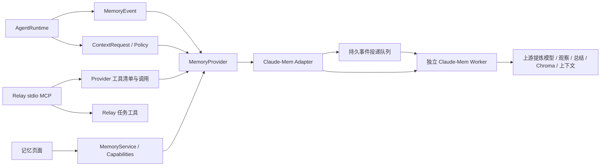

# Memory Provider

Relay 负责用户对话、任务队列、执行会话、文件和工具入口。Memory Provider 负责把这些活动变成可恢复的记忆。当前只保留 `claude-mem` Provider。原 Native 记忆引擎（Observer、来源/提炼表、FTS/向量检索、Embedding 客户端、确认修订工具）已从代码移除。任务与会话存储拆到 `resident`。

## 顶层边界



- `relay-core::memory` 定义 UI 数据和语义能力；UI 不依赖某个引擎。
- `relay-runtime::memory::MemoryProvider` 统一 `record / context / tools / call / start / imports_history`，扩展 `MemoryService`。Provider 无需 Relay 的 Agent 执行宿主，提炼由外部 Worker 管理。
- `AgentRuntime` 将用户输入、终态工具结果、轮次结束、会话结束交给选中的 Provider。逻辑 thread 和工作目录保持 Relay 的身份，不由检索结果改变。
- `ResidentWorker` 只调度任务、进行允许的归档扫描，启动选中 Provider 的后台工作。不会再创建 Relay 内部 Observer 或 Embedding 线程。
- 应用、MCP 和记忆页面使用同一配置。MCP 仍是 Relay 的 stdio Server：Relay 处理任务工具，Provider 决定记忆工具。没有把 Claude-Mem 的全部 MCP 权限直接暴露给任务 Agent。
- `ResidentStore` 只维护任务、请求、会话绑定、消息编号和 thread 资料；`MemoryProvider` 工厂不依赖它。SQLite 记忆引擎只在 Claude-Mem Worker 内。Relay 的另一份 SQLite 仅为投递日志。

代码入口：[`memory/mod.rs`](../crates/relay-runtime/src/memory/mod.rs)、[`core/memory.rs`](../crates/relay-core/src/memory.rs)、[`main.rs`](../crates/relay/src/main.rs)。

## Claude-Mem 的实际接入

对照并实测的上游版本是 **13.31.0**，commit [`c8f544556c59f74dd7a6737f47b54b395ab087c0`](https://github.com/thedotmack/claude-mem/tree/c8f544556c59f74dd7a6737f47b54b395ab087c0)。它当前采用 [Apache-2.0](https://github.com/thedotmack/claude-mem/blob/c8f544556c59f74dd7a6737f47b54b395ab087c0/LICENSE)。这是对本地 Worker HTTP API 的适配，不是 fork 引擎，也不是只调用 embeddings 建一个新 RAG。其他版本尚未逐版验证。

| Relay 行为 | Worker 接口 / 含义 |
| --- | --- |
| 用户消息 | `POST /api/sessions/init`，建立或继续持久逻辑 session、提交 prompt |
| 终态工具结果 | `POST /api/sessions/observations`，稳定 `tool_use_id`，交给 Worker 提炼 |
| 完整 assistant 回复 | `RelayAssistantResponse` observation；明确保留其助手来源 |
| 完成一轮 | `POST /api/sessions/summarize`，由 Worker 生成结构化总结 |
| 断开 / 正常退出 | 持久记录 `POST /api/sessions/session-end`；下次投递仍可完成收尾 |
| 渐进检索 | `memory_search → memory_timeline → memory_get` 对应上游 search、timeline、observation/session 查询 |
| 查询总结 | `memory_summaries` 读取上游 summaries |
| 手动记忆 / 删除 | `POST /api/memory/save` / `DELETE /api/observation/:id` |
| 恢复上下文 | `GET /api/context/inject`，遵守 Relay 的注入策略 |
| 状态 | Relay 投递队列 + Worker health / processing-status / chroma/status |

事件入本地队列后即返回，不等模型推理。Worker 的 `queued` 仅代表接收；生成观察、总结和完成向量索引是后续阶段。查询 JSON 不报告每次检索实际采用的模式，因此 Relay 返回 `upstream-managed` 和明确说明，不伪报 hybrid 成功。未完成/取消的 assistant 回复不作为完整答案提炼；已经结束的工具事件仍保留。

上游会为 `context/inject` 加入一段项目级 Work State 待办规则，要求使用它自己的任务工具，且这段内容不按任务来源过滤。适配器只保留其记忆段，排除这段 Work State。若布局不能识别，会显式报上下文不可用。保留的观察仍是参考资料；工具名称映射和不确定性提示由 Relay 加在外层。手动保存的观察没有 concepts，上游默认上下文过滤可能不自动注入它，仍可通过检索和详情读取。

## 作用域与能力

默认 namespace 为 Relay 数据目录规范路径的散列；可在配置中明确设定。每个 namespace 是 Worker 的一个 project。主对话使用 `relay-global` 来源，各任务使用 `relay-task-<thread_id>`，导入归档使用 `relay-archive`。

主 Agent 可读取当前 namespace 全部记忆。任务只能读共享记忆和本任务记忆，只能写本任务；删除只提供给主 Agent。查询固定 project/platformSource，详情与删除再核验来源。上游部分 observation/search 响应不含 `platform_source`，适配器通过 `/api/sdk-sessions/batch` 取得真实来源后校验，不能从记忆正文猜作用域。历史导入资料只向主 Agent 开放。这是 Relay 工具边界，不是对同机直接访问 Worker API 的身份认证。

页面和 MCP 提供观察查询、渐进检索、总结、手动写入、单条观察删除与投递状态。候选确认、来源版本、修订链、来源级级联遗忘、主题集合和 Relay 提炼预算已移除。`MemoryCapabilities` 当前只声明 `forget_memory` 与 `retry`，其余通用读操作属于服务契约；以后接其他引擎仍通过 Provider 扩展。

删除 observation 不会自动删除原始 prompt、tool-use 或 session summary，也不能撤回 Harness 已收到的上下文。旧 Native 数字 ID 不可拿来操作 Worker 记录。阿里云 Embedding 配置和钥匙串 Key 保留在原位置，不再被这个记忆模块读取，也不会自动交给 Claude-Mem；Worker 的模型和 Embedding 独立配置。

## 配置与启用

配置在 `$RELAY_DATA_DIR/memory-provider.json`；未设置 `RELAY_DATA_DIR` 时使用应用默认数据目录。通过已构建的 `Relay` 可执行文件运行：

```sh
Relay --memory-provider
Relay --memory-provider-set claude-mem http://127.0.0.1:37777
Relay --memory-provider-check
Relay --memory-context session
# 重启 Relay 后生效
```

显式 URL 优先。没有 URL 时，从 `CLAUDE_MEM_WORKER_PORT` 或 Claude-Mem 数据目录的 `settings.json` 读取端口；数据目录支持 `CLAUDE_MEM_DATA_DIR` 和默认设置里的重定向。都未设置时采用已核验上游 13.31.0 的默认值 `37700 + uid % 100`（非 Unix 为 37777）。示例 `37777` 应替换成实际端口，可用 `--memory-provider` 查看 Relay 解析的 URL。仅接受无凭据、无路径、带明确端口的 loopback HTTP URL。配置原子写入并限制权限；未知配置版本或损坏文件会报错并保留原文件。

Relay 不自动安装或启动 Worker，也不改 Claude/Codex 的 hooks。由用户独立运行兼容 Worker、配置其提炼模型和 Chroma。隔离测试直接运行上游 `plugin/scripts/worker-service.cjs --daemon`，显式指定 `CLAUDE_MEM_DATA_DIR` 和端口；需要 Bun、上游运行依赖，以及启用 Chroma 时的 uv/chroma-mcp。直接启动 bundle 不等于完整插件安装流程。Worker 的模型调用可能持续到 Relay 退出之后；Relay 只负责自己的投递线程。

```json
{
  "version": 2,
  "provider": "claude-mem",
  "context": "session",
  "claude_mem_url": "http://127.0.0.1:37777",
  "namespace": "relay-personal",
  "import_history": false
}
```

注入策略 `disabled / session / turn` 分别为不注入、执行 session 首轮、每轮；默认 `turn`。关闭记忆注入不关闭 Relay 的角色、任务状态、用户主动附加的资料或 MCP 工具。上下文请求失败会在对话提示并继续本轮，用户消息若未能写入记忆投递日志，本轮不会发送。

修改 Provider 配置后需重启。配置指纹进入执行会话恢复标识和 MCP 启动参数，防止用旧 checkpoint 恢复出混合 Provider 会话。本版本不能切回已删除的 Native Provider。若改变 Worker URL 或 namespace，会使用独立投递目录，原队列仍保留；请先处理原队列。仅改变注入策略/导入开关不会丢失队列。

历史导入需显式开启 `Relay --memory-provider-import-history on`。它将 Relay 消息和已有客户端归档重新交给上游提炼，不导入旧 Native 派生记忆或确认状态。关闭时不自动把既有 Native 历史上传到 Worker。Claude-Mem 不具备旧引擎的来源修订/tombstone 语义，已导入的历史改写不会自动撤回旧观察。

## 旧数据兼容

- `relay.sqlite3` schema 升级到 3，只维护协调状态。v1/v2 的旧记忆表和内容原样保留，旧来源 key 仅用于一次性恢复消息编号下限。旧 Observer thread 不可执行，旧 Relay 会拒绝这个版本，避免重启已停用的引擎。
- 新数据目录不创建 `sources`、`memories`、`jobs`、FTS 或向量表。旧 `projects.json` 与 conversation 文件继续保留并兼容导入历史 thread，薄记忆不再自动提炼。
- 配置 v1 的 `native` 在读取时迁为 v2 `claude-mem` 并关闭历史导入，原配置文件保留到显式保存；既有 v1 Claude-Mem 保留 URL、namespace、导入选择与待投递队列。未知未来版本不会覆盖。
- 此次删除的是实现与入口，不清理用户历史数据库、文件或钥匙串。没有实现把旧 Native 记忆迁移到 Worker 的转换器。

## 投递恢复

`memory-providers/<endpoint-and-namespace-hash>/delivery.sqlite3` 是传输日志，使用 WAL、事务和进程间锁，不是另一套记忆提炼引擎。事件有稳定去重键；同一 session 的投递保持顺序，不确定/失败项阻止其后续事件，其他 session 可继续。收到确认后清除日志中的事件正文，保留去重记录。

- POST 前 Worker 不可达：保留 pending，后台继续尝试。
- 明确 4xx 拒绝（408 除外）：failed，修复原因后显式重试。
- POST 超时、异常响应、5xx 或发送中崩溃：uncertain，不自动重放。上游 init/summarize 不是通用 exactly-once API，不能保证所有重试无副作用。
- Worker 主动跳过的事件单独计为 skipped，不算成功提炼。

单个序列化事件最多 2 MiB，超出会明确报告采集失败，不截断后伪装成功。尚未发送的同一终态事件可更新为更完整的 payload；已接收事件不会自动重放为一次“修订”。

```sh
Relay --memory-provider-check
Relay --memory-provider-drain
Relay --memory-provider-retry
# 先对照 Worker viewer / 原始记录检查，再按 delivery issue ID 处理：
Relay --memory-provider-resolve 12 accepted
Relay --memory-provider-resolve 12 retry
Relay --memory-provider-resolve 12 discard
```

`accepted` 表示操作者确认上游已接收，`retry` 允许重新发送并承担重复可能，`discard` 明确放弃该事件。投递状态中的 accepted 不代表生成观察或向量成功；Worker 的处理状态和 Chroma 健康是全局数据，不会展示成当前 Relay 的提炼数量。

## 验证

仓库检查：`cargo xtask verify`。Provider 合约测试覆盖生命周期顺序/去重、离线、未知 POST、崩溃恢复锁、作用域校验、MCP 能力、配置保护、历史导入开关、注入策略，旧数据库/配置升级、任务调度/取消/结果回收，以及真实 AgentRuntime 在 Worker 离线时继续发送且持久保留事件。新数据库不创建 Native 记忆表。UI 测试覆盖观察查询、取消/确认删除、投递重试和过期查询保护。

两项真实 Worker 测试默认 **ignored**，必须使用独立测试目录/Worker 明确运行：

```sh
RELAY_TEST_CLAUDE_MEM_URL=http://127.0.0.1:37777 \
  cargo test -p relay-runtime --all-features memory::tests::real_worker_manual_memory_roundtrip -- --ignored --nocapture

# 会调用 Worker 配置的模型；只发送合成的 WAL 队列测试会话
RELAY_TEST_CLAUDE_MEM_LIFECYCLE_URL=http://127.0.0.1:37777 \
  cargo test -p relay-runtime --all-features memory::tests::real_worker_extracts_observations_and_summary_from_relay_lifecycle -- --ignored --nocapture
```

本次真实验证包含手动保存/列表/详情/搜索/timeline/上下文/删除，以及上游 Codex Provider 实际生成观察与总结；另启用 Chroma 验证索引同步和深度语义探测。合成用例证明接入链路，不能代表中文召回效果或长期记忆质量评测。详见 [验收记录](validation/memory-providers-2026-10-05.json)。
